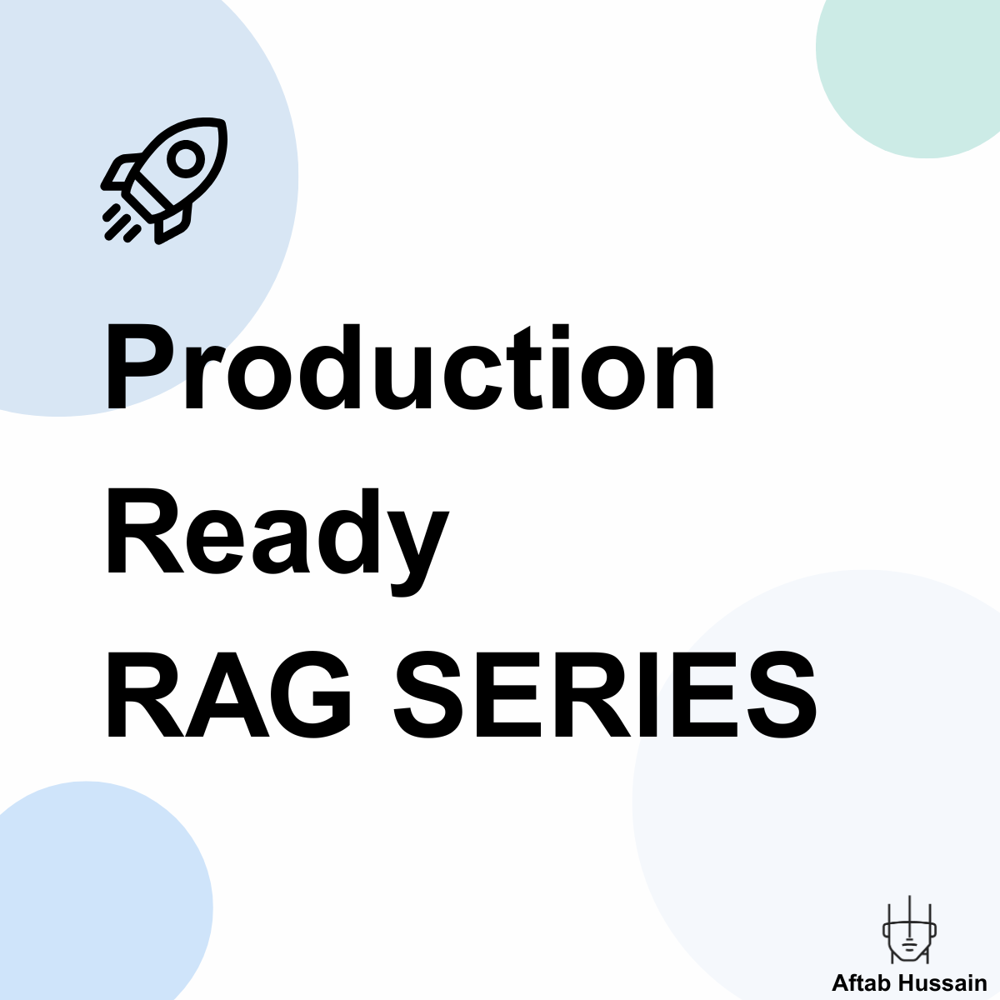

<div align="center">
  
</div>

# Production Ready RAG Series

A comprehensive, hands-on series covering Retrieval-Augmented Generation (RAG) from fundamentals to production deployment. This repository contains practical implementations, educational content, and real-world examples using LangChain, Pinecone, and OpenAI.

**Learn by building real production systems with cutting-edge techniques!**

## What You'll Learn

This series covers the complete RAG pipeline:

- **Retrieval Fundamentals**: Keyword, semantic, and hybrid search methods
- **Advanced Chunking**: From basic splitting to AI-powered semantic and agentic chunking
- **LLM Parameter Optimization**: Systematic tuning for cost, quality, and performance
- **Evaluation & Metrics**: Precision, recall, MRR, NDCG, and more
- **LLM Integration**: Prompt engineering, context handling, and hallucination prevention
- **Production Readiness**: Logging, monitoring, optimization, and deployment
- **Advanced Techniques**: Cross-encoders, reranking, and agentic RAG

## Tech Stack

- **LangChain**: Framework for building RAG applications
- **Pinecone**: Vector database for storing and searching embeddings
- **OpenAI**: Embedding models and LLM integration
- **Python**: Core implementation language
- **Jupyter Notebooks**: Interactive learning and experimentation

## Getting Started

### Prerequisites

- Python 3.8+
- OpenAI API key
- Pinecone API key

### Installation

1. **Clone the repository**
   ```bash
   git clone https://github.com/yourusername/production-ready-rag-series.git
   cd production-ready-rag-series
   ```

2. **Install dependencies**
   ```bash
   pip install -r requirements.txt
   ```

3. **Set up environment variables**
   ```bash
   export OPENAI_API_KEY="your-openai-api-key"
   export PINECONE_API_KEY="your-pinecone-api-key"
   ```

4. **Start with Module 1**
   ```bash
   jupyter notebook modules/01_search_techniques.ipynb
   ```

## Repository Structure

```
production-ready-rag-series/
├── modules/              # Learning modules and notebooks
│   ├── 01_search_techniques.ipynb      # Module 1: Search Methods & Techniques
│   ├── 02_chunking_techniques.ipynb    # Module 2: Production-Ready Chunking
│   ├── 03_advanced_chunking_techniques.ipynb  # Module 3: Advanced AI-Powered Chunking
│   └── 04_llm_parameter_exploration.ipynb     # Module 4: LLM Parameter Optimization
├── data/                # Dataset and supporting files
│   ├── data.joblib      # Educational dataset (100 LangChain docs)
│   └── bm25_values.json # BM25 sparse vectors
├── docs/                # Documentation and curriculum
│   └── content.md       # Detailed curriculum outline
├── requirements.txt     # Python dependencies
├── .gitignore          # Git ignore rules
├── LICENSE             # MIT License
└── README.md           # This file
```

## Module Overview

### Module 1: Search Techniques & Methods
- **Keyword Search**: BM25 implementation with Pinecone sparse vectors
- **Semantic Search**: OpenAI embeddings with dense vector search
- **Hybrid Search**: Combining both approaches for optimal results
- **Metadata Filtering**: Advanced search within document subsets

### Module 2: Chunking Techniques
- **Fixed-Size Chunking**: Character and token-based splitting with LangChain
- **Variable-Size Chunking**: Recursive and semantic-aware approaches
- **Mixed Strategies**: Hybrid chunking for optimal document processing
- **Pinecone Integration**: Production vector storage with serverless architecture
- **Complete RAG Pipeline**: End-to-end retrieval system with OpenAI

### Module 3: Advanced Chunking Techniques
- **Semantic Chunking**: LangChain SemanticChunker and custom embedding-based approaches
- **Agentic Chunking**: LLM-powered intelligent boundary detection using GPT models
- **Enhanced Agentic Chunking**: Sophisticated proposition-based chunking with iterative processing
- **Production Evaluation**: Comprehensive cost analysis and decision frameworks

### Module 4: LLM Parameter Exploration & Optimization
- **Temperature Control**: Systematic analysis of randomness vs. consistency trade-offs
- **Top-p (Nucleus Sampling)**: Diversity control through probability thresholds
- **Parameter Interactions**: Scientific approach to testing parameter combinations
- **Production Optimization**: Quality vs. speed vs. cost analysis with real scenarios
- **Cost Reduction Strategies**: Practical techniques achieving 30-60% cost savings
- **Use Case Profiles**: Optimized parameters for customer support, education, advisory services

### Module 5: Evaluation & Metrics (Coming Soon)
- Retrieval effectiveness metrics
- Ranking evaluation techniques
- Reciprocal Rank Fusion (RRF)

### Module 6: Advanced Techniques (Coming Soon)
- Cross-encoders vs bi-encoders
- Reranking with LLMs
- Query parsing and optimization

### Module 7: LLM Integration (Coming Soon)
- Prompt engineering for RAG
- Context handling strategies
- Hallucination prevention

### Module 8: Production Readiness (Coming Soon)
- Logging and monitoring
- Performance optimization
- Cost management

### Module 9: Deployment (Coming Soon)
- Production deployment strategies
- Security considerations
- Multimodal RAG

## Key Features

- **Hands-on Implementation**: Real code examples for every concept
- **Production Focus**: Best practices and optimization techniques
- **Comprehensive Coverage**: From basics to advanced AI-powered systems
- **Interactive Learning**: Jupyter notebooks for experimentation
- **Cutting-Edge Techniques**: Latest advances including agentic and semantic chunking
- **Real-world Examples**: Practical use cases and implementations
- **Cost Analysis**: Detailed comparisons and decision frameworks

## Dataset

The series uses a custom educational dataset located in the `data/` directory:
- **`data.joblib`**: 100 LangChain Document objects covering:
  - AI and machine learning concepts
  - RAG implementation details
  - LangChain and Pinecone tutorials
  - Production deployment strategies
- **`bm25_values.json`**: Pre-computed BM25 sparse vectors for efficient keyword search

Each document includes rich metadata for learning different search and filtering techniques.

## Contributing

Contributions are welcome! Please feel free to submit a Pull Request. For major changes, please open an issue first to discuss what you would like to change.

## License

This project is licensed under the MIT License - see the [LICENSE](LICENSE) file for details.

## Connect

- **LinkedIn**: [Your LinkedIn Profile]
- **GitHub**: [Your GitHub Profile]
- **Blog**: [Your Blog/Website]

## Acknowledgments

- LangChain team for the excellent framework
- Pinecone for the powerful vector database
- OpenAI for the embedding models and LLM capabilities
- The open-source AI community for inspiration and collaboration

---

## What Makes This Series Unique?

- **Production-Ready Focus**: Every technique is designed for real-world deployment
- **Advanced AI Techniques**: Includes cutting-edge methods like agentic chunking that rival commercial implementations
- **Cost-Aware Design**: Detailed analysis of computational costs and trade-offs
- **Complete Implementations**: Full working code, not just concepts
- **Comprehensive Evaluation**: Statistical analysis and decision frameworks
- **Latest Technologies**: Uses the newest LangChain experimental features and OpenAI models

---

<div align="center">

**Ready to build production-ready RAG systems with cutting-edge AI techniques?**

**Start with Module 1 and transform your applications!**

</div>
